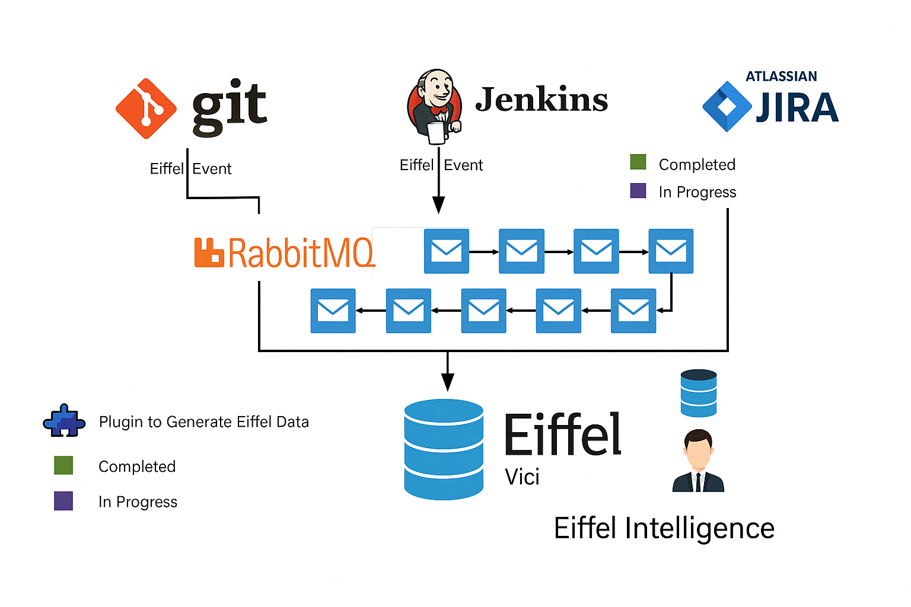
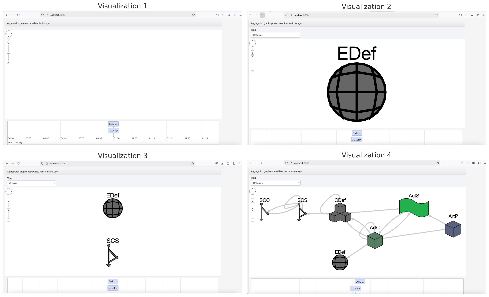

# Eiffel-Store

**Eiffel-Store** is a real-time persistence and visualization tool for Eiffel events, offering traceability across CI/CD pipelines. Unlike Eiffel-Vici, which provides batch visualization, Eiffel-Store updates its visualization live as new events are inserted into the database. It is designed to help developers trace software changes from commit to deployment and detect faults in real-time.

---

## 🛠️ Installing

Follow these instructions to run Eiffel-Store locally for development and testing purposes:

1. **Clone the repository**  
2. Open a terminal and navigate to the `Visualization` folder.  
3. Run the following command:

```bash

meteor
```

    If prompted to install missing npm plugins, follow the suggestions in the terminal.

    Access the app in your browser:

http://localhost:3000

    Open the MongoDB instance (usually on port 3001) and access the meteor database.

    Create the following collections (case-sensitive):

    eiffel-events

    eventfilter

    events

    eventsequences

    tablerows

🚀 Getting Started

After setup:

    Add Eiffel events one by one to the eiffel-events collection in the meteor database.

    Refresh localhost:3000 to see the live visualization update.

📝 Note:

Eiffel-Store does not support bulk inserts. Insert one event at a time to maintain live visualization integrity.
🔄 RabbitMQ Integration

Your CI tools (e.g., Jenkins, Gerrit) can publish Eiffel events to a RabbitMQ message bus.

To bridge RabbitMQ and Eiffel-Store:

👉 Use this Java utility: rabbitmq-eiffel-store

This tool listens to RabbitMQ and pushes events to MongoDB, making them instantly visible in Eiffel-Store.
📷 Architecture Overview

The diagram below   illustrates the architecture of Eiffel-Store and its relationship with Git, Jenkins, Jira, RabbitMQ, and MongoDB:


🔎 Explanation:

    Git, Jenkins, and Jira generate Eiffel events.

    These events are sent to RabbitMQ (message queue).

    The Eiffel-Store service listens to the RabbitMQ stream or direct DB insertions.

    Events are stored in MongoDB and visualized as a directed graph using Meteor.js.

    This enables real-time traceability from code commits to downstream artifacts and failures.

    Plugins are used to auto-generate Eiffel data from tools like Jenkins or Git.

🧠 Tool Output

Figure  demonstrates how the live visualization evolves as Eiffel events are progressively inserted into the system. 

    Visualization 1 depicts the initial empty state with only timeline controls visible. As no events are yet received, no graphical representation is shown.

    Visualization 2 displays the first recognized event, an EiffelEnvironmentDefinedEvent (EDef), which initializes the environment setup. This is the base upon which all subsequent events link.

    Visualization 3 adds a SourceChangeSubmittedEvent (SCS), indicating a commit submission. This illustrates how live data begins to form a directed graph.

    Visualization 4 presents a complete chain including events such as {SourceChangeCreated (SCC)}, {ArtifactCreated (ArtC)}, {ArtifactPublished (ArtP)}, and {ActivityStarted (ActS)}. This comprehensive visualization allows users to trace from code commit to product artifact, offering end-to-end CI/CD traceability.

🧠 Research and Industrial Use

Eiffel-Store has been used in multiple empirical software engineering studies and in industrial settings to:

    Analyze CI/CD processes.

    Improve fault localization.

    Support real-time compliance and traceability.

📚 Related Projects

    Eiffel-Vici (batch-based)

    RabbitMQ Eiffel Publisher

📧 Support

For issues or questions, contact:
📩 azeem.ahmad@ericsson.com
